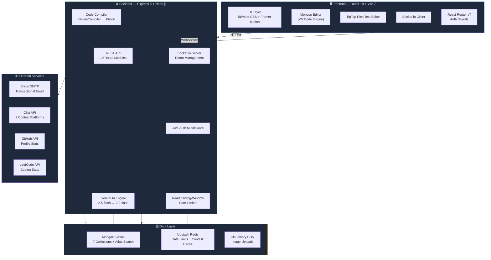
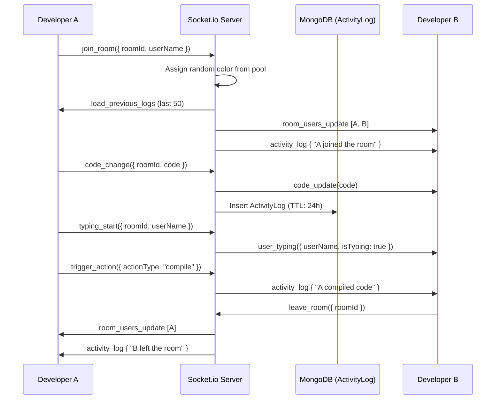
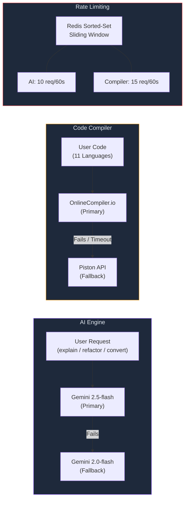
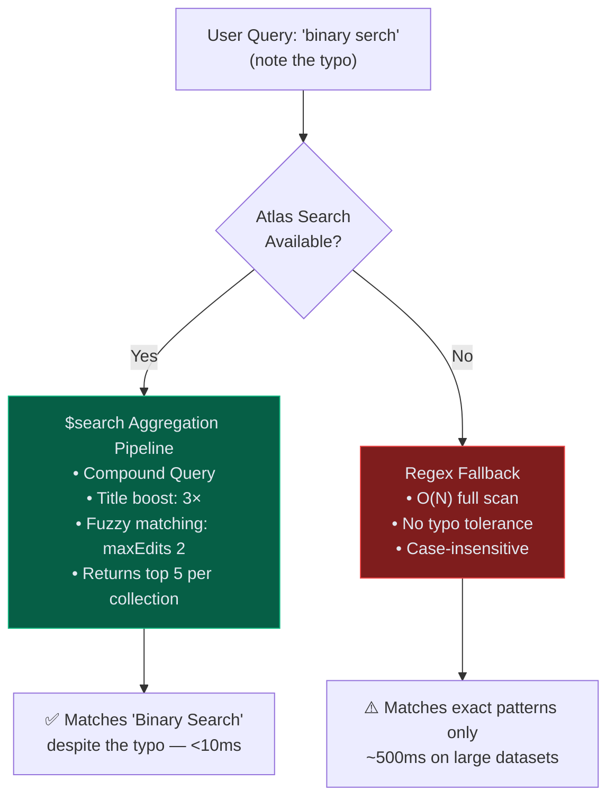
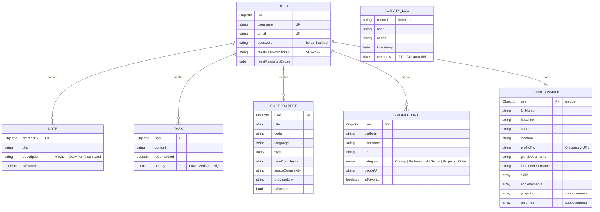

<div align="center">

# ⚡ Relay

### The Collaborative Developer Workspace — Built for Engineering Teams

[](https://react.dev)
[](https://nodejs.org)
[](https://mongodb.com)
[](https://socket.io)
[](https://ai.google.dev)
[](https://upstash.com)
[](https://docker.com)
[](LICENSE)

**[Live Demo](https://devnexus-app.vercel.app)** · **[API Endpoint](https://devnexus-api.onrender.com)** · **[Watch Demo ▶️](https://youtu.be/EKsHeZQpwYA)**

<br/>


</div>

---

## 📌 Why Relay Exists

Modern developers switch between **7+ tools daily** — a code editor, documentation wiki, task board, snippet manager, profile tracker, and AI assistant — each in a separate tab, each with its own auth, its own data silo. **Relay collapses all of that into a single, real-time workspace.**

It's not just a CRUD app. It's a **production-grade, multi-service platform** with WebSocket collaboration, AI-powered code intelligence, a distributed caching layer, and sub-10ms search — the kind of system architecture you'd find at a startup shipping to thousands of users.

---

## 🏆 Engineering Highlights at a Glance

| Metric | Detail |
|:---|:---|
| **Real-Time Collaboration** | Multi-user code rooms with live cursors, typing indicators, and activity feeds via Socket.io |
| **Search Latency** | **<10ms** using MongoDB Atlas Search (Apache Lucene inverted indexes) — **~100× faster** than Regex |
| **Workspace AI (RAG)** | Custom Retrieval-Augmented Generation pipeline using `text-embedding-004` and Atlas Vector Search |
| **AI Engine** | Dual-model failover: Gemini 2.5-flash → 2.0-flash with explain, refactor, and convert actions |
| **Code Execution** | 11 languages (JS, TS, Python, Java, C, C++, Go, Rust, PHP, Ruby, Swift) with dual-compiler failover |
| **Rate Limiting** | Redis sorted-set sliding window algorithm (not naive token bucket) — AI: 10 req/min, Compiler: 15 req/min |
| **Caching** | Upstash Redis with stale-cache fallback for contest data (1hr TTL) |
| **Security** | JWT auth + bcrypt hashing + DOMPurify (both client & server-side) + SHA-256 reset tokens |
| **Data Cleanup** | MongoDB TTL indexes auto-purge activity logs after 24 hours — zero manual maintenance |
| **Components** | 35+ React components, largest at 43KB (ProfileManager) |
| **Deployment** | Dockerized (docker-compose), Vercel (frontend), Render (backend) |

---

## 🏗️ System Architecture



---

## 🧠 AI Knowledge Pipeline (RAG)

> Relay isn't just a wrapper around the Gemini API. It features a fully custom **Retrieval-Augmented Generation (RAG)** architecture built entirely in Node.js, allowing developers to literally "chat" with their own codebase and documentation.

### The Vector Engineering Flow

1. **Embedding Generation**: When a user saves a Code Snippet or DevDoc, Mongoose `pre('save')` hooks automatically send the content to Google's `text-embedding-004` model.
2. **Vector Storage**: The resulting 768-dimensional mathematical vector is saved directly into MongoDB alongside the document.
3. **Semantic Search**: When the user asks the Workspace AI a question (e.g., *"Where is my binary search code?"*), the backend embeds the query and executes an Atlas `$vectorSearch` aggregation pipeline to find the 3 most mathematically relevant snippets and notes.
4. **Context Injection**: The retrieved personal code is injected into the Gemini prompt as hidden context, allowing the AI to answer specifically based on the user's exact workspace data.

This completely eliminates AI hallucinations and turns Relay into a personalized "second brain" for developers.

---

## ⚡ Real-Time Collaboration Engine

> This is the **flagship feature** of Relay — the one that separates it from any typical MERN project.

### Architecture Deep-Dive



### What Makes It Special

| Feature | Implementation | Why It Matters |
|:---|:---|:---|
| **Live Code Sync** | `code_change` events broadcast to all room members via Socket.io | Every keystroke is shared in real-time — no save/refresh cycle |
| **Typing Indicators** | `typing_start` / `typing_stop` events with per-user state | See exactly who is actively editing, just like Google Docs |
| **Presence Awareness** | In-memory `roomUsers` Map with 6 unique color assignments | Instantly know who's in your room with color-coded avatars |
| **Activity Feed** | Real-time `activity_log` events persisted to MongoDB | Full audit trail: joins, leaves, compiles, AI actions |
| **Auto-Cleanup** | MongoDB TTL index (`expireAfterSeconds: 86400`) | Logs self-destruct after 24 hours — zero maintenance, zero cost growth |
| **History on Join** | Last 50 activity entries loaded on `join_room` | New joiners get immediate context — no "what did I miss?" |


<p align="center">
  
  &nbsp;
  
  &nbsp;
  
</p>

---

## 🧠 AI & Code Execution Pipeline

Relay doesn't just call an API — it implements a **dual-model failover strategy** for both AI and compilation, ensuring the user never sees a dead-end error.



### Supported Languages
`JavaScript` · `TypeScript` · `Python` · `Java` · `C` · `C++` · `Go` · `Rust` · `PHP` · `Ruby` · `Swift`

<p align="center">
  
  &nbsp;
  
</p>

---

## 🔍 Search Architecture — Atlas Search vs Regex

Relay implements **MongoDB Atlas Search** powered by Apache Lucene inverted indexes, with an automatic Regex fallback for environments where Atlas Search is unavailable.



| Benchmark | Atlas Search | Regex Fallback | Improvement |
|:---|:---:|:---:|:---:|
| **Latency** (1000 docs) | ~8ms | ~500ms | **~60× faster** |
| **Fuzzy Matching** | ✅ Yes (Levenshtein distance ≤ 2) | ❌ No | — |
| **Relevance Scoring** | ✅ Weighted (title 3×, content 1×) | ❌ No ranking | — |
| **Autocomplete** | ✅ Prefix + n-gram | ❌ None | — |

---

## 💎 Feature Breakdown

### 1. RelaySandBox — Real-Time Collaborative Code Editor
- **Monaco Editor** (the same engine powering VS Code) with full IntelliSense
- Create or join rooms instantly via Room ID — no sign-up required for guests
- Live code sync, typing indicators, and color-coded presence avatars
- Integrated AI actions (explain, refactor, convert) and compiler — all within the same pane
- Activity feed logs every action (join, leave, compile, AI request) in real-time

### 2. DevDocs Manager — Rich-Text Documentation Hub
- Built on **TipTap** with support for headings, bold, italics, code blocks, lists, links, and image embeds
- Pin critical notes to the top of your workspace
- Server-side **DOMPurify** sanitization prevents XSS from injected HTML
- Image uploads via **Cloudinary CDN**


### 3. Code Vault — Snippet Library with Complexity Tracking
- Store reusable algorithms with automatic syntax highlighting (`react-syntax-highlighter`)
- Track **time & space complexity** per snippet — ideal for interview prep
- Tag-based filtering (`#dp`, `#recursion`, `#graphs`) and full-text search
- **Direct Save**: Push working code from RelaySandBox compiler straight into your Vault


### 4. Task Board — Kanban-Style Task Management
- Three-column Kanban: **Todo**, **In Progress**, **Completed**
- Priority levels: Low / Medium / High with visual indicators
- Tasks sorted with incomplete items first, then by creation date


### 5. Dynamic Career Profile — Public Developer Portfolio
- Automatically aggregates stats from **GitHub** and **LeetCode** APIs
- Generates a **public shareable link** (`/u/username`) — a live resume that's always up-to-date
- Showcase skills, projects, achievements, and resumes
- Auto-generated project cover images via **GitHub OpenGraph**


### 6. Secure Authentication & Recovery
- **JWT** stateless auth with 30-day token expiry
- **bcryptjs** password hashing with salting
- Password reset flow: SHA-256 token → Brevo SMTP email → 15-minute expiry window
- **DOMPurify** sanitization on both client and server to prevent XSS


<p align="left">
  
  &nbsp; &nbsp; 
</p>

### 7. Additional Power Features

| Feature | Description |
|:---|:---|
| **Command Palette** | `⌘K` / `Ctrl+K` — VS Code-style fuzzy command search across all workspace actions |
| **Contest Radar** | Live feed of upcoming contests from 9 platforms (Codeforces, LeetCode, CodeChef, AtCoder, etc.) with Redis caching |
| **Analytics Dashboard** | Workspace statistics, activity trends, and productivity insights |
| **Focus Timer** | LeetCode-style non-blocking timer in navbar with Stopwatch + Countdown modes |
| **Scratch Pad** | `⌘.` / `Ctrl+.` — Quick note-taking overlay without leaving your current view |
| **Theme System** | Dark/Light mode toggle with `localStorage` persistence, defaults to dark |
| **Collapsible Sidebar** | Icon-only mode for maximum coding real estate with hover tooltips |
| **Splash Screen** | Branded loading sequence with the Relay logo |

---

## 🛠️ Tech Stack — Full Breakdown

### Frontend
| Technology | Purpose |
|:---|:---|
| **React 19** | UI framework with latest concurrent features |
| **Vite 7** | Build tool — instant HMR, ESBuild-powered bundling |
| **Tailwind CSS 3.4** | Utility-first styling with custom design tokens |
| **Framer Motion** | Declarative animations, page transitions, layout animations |
| **Monaco Editor** | VS Code's editor engine — full IntelliSense, syntax highlighting |
| **TipTap** | Headless rich-text editor (extensible: images, links, alignment) |
| **Socket.io Client** | Real-time WebSocket communication |
| **React Router v7** | Client-side routing with auth guards |
| **React Syntax Highlighter** | Code block rendering with 100+ language themes |

### Backend
| Technology | Purpose |
|:---|:---|
| **Express 5** | HTTP framework with async error handling |
| **Socket.io** | WebSocket server for real-time room management |
| **Mongoose** | MongoDB ODM — 7 models with indexes, TTL, and refs |
| **Google Gemini API** | AI code intelligence (explain, refactor, convert) |
| **Upstash Redis** | Serverless Redis for rate limiting + contest caching |
| **Cloudinary** | CDN for image uploads (profile pics, doc images) |
| **Brevo (Sendinblue)** | Transactional SMTP email for password resets |
| **Multer** | Multipart file upload handling (5MB limit) |
| **DOMPurify + jsdom** | Server-side HTML sanitization |
| **jsonwebtoken** | JWT generation & verification |
| **bcryptjs** | Password hashing with salt rounds |

### Infrastructure
| Technology | Purpose |
|:---|:---|
| **MongoDB Atlas** | Managed database with Atlas Search (Lucene indexes) |
| **Vercel** | Frontend deployment with SPA rewrites |
| **Render** | Backend deployment with Node.js runtime |
| **Docker Compose** | Containerized local development (backend + frontend) |

---

## 📊 Data Model



---

## 🔌 API Reference

### Complete Route Map

| Module | Method | Endpoint | Auth | Rate Limited | Description |
|:---|:---|:---|:---:|:---:|:---|
| **Auth** | `POST` | `/api/users/register` | — | — | Register with username, email, password |
| | `POST` | `/api/users/login` | — | — | Login, returns JWT (30d expiry) |
| | `GET` | `/api/users/me` | ✅ | — | Get authenticated user profile |
| | `POST` | `/api/users/forgot-password` | — | — | Send password reset email via Brevo |
| | `POST` | `/api/users/reset-password/:token` | — | — | Reset password (SHA-256 token, 15min expiry) |
| **Notes** | `GET` | `/api/notes` | ✅ | — | Get all notes (pinned first) |
| | `POST` | `/api/notes` | ✅ | — | Create note (DOMPurify sanitized) |
| | `PUT` | `/api/notes/:id` | ✅ | — | Update note (ownership verified) |
| | `DELETE` | `/api/notes/:id` | ✅ | — | Delete note (ownership verified) |
| | `PUT` | `/api/notes/:id/pin` | ✅ | — | Toggle pin status |
| **Snippets** | `GET` | `/api/snippets` | ✅ | — | Get snippets (favorites first) |
| | `POST` | `/api/snippets` | ✅ | — | Create snippet with tags & complexity |
| | `PUT` | `/api/snippets/:id` | ✅ | — | Update snippet |
| | `DELETE` | `/api/snippets/:id` | ✅ | — | Delete snippet |
| **Tasks** | `GET` | `/api/tasks` | ✅ | — | Get tasks (incomplete first) |
| | `POST` | `/api/tasks` | ✅ | — | Create task with priority |
| | `PUT` | `/api/tasks/:id` | ✅ | — | Update task content/status |
| | `DELETE` | `/api/tasks/:id` | ✅ | — | Delete task |
| **Profile** | `GET` | `/api/user-profile` | ✅ | — | Get profile (auto-creates if missing) |
| | `PUT` | `/api/user-profile` | ✅ | — | Update profile fields |
| | `GET` | `/api/user-profile/public/:username` | — | — | Public profile by username |
| **Links** | Full CRUD | `/api/profiles` | ✅ | — | Manage platform profile links |
| **Search** | `GET` | `/api/search?q=...` | ✅ | — | Atlas Search (Lucene) with Regex fallback |
| **AI** | `POST` | `/api/ai/process` | ✅ | ✅ 10/min | Explain, refactor, or convert code |
| **Compiler** | `POST` | `/api/compiler/run` | ✅ | ✅ 15/min | Execute code in 11 languages |
| **Contests** | `GET` | `/api/contests` | — | — | Upcoming contests (Redis-cached, 1hr TTL) |
| **Upload** | `POST` | `/api/upload` | — | — | Cloudinary image upload |

### WebSocket Events

| Direction | Event | Payload | Description |
|:---|:---|:---|:---|
| Client → Server | `join_room` | `{ roomId, userName }` | Join a collaboration room |
| Client → Server | `code_change` | `{ roomId, code }` | Broadcast code changes |
| Client → Server | `language_change` | `{ roomId, language }` | Sync language selection |
| Client → Server | `typing_start` | `{ roomId, userName }` | Show typing indicator |
| Client → Server | `typing_stop` | `{ roomId }` | Hide typing indicator |
| Client → Server | `trigger_action` | `{ roomId, userName, actionType }` | Log compile/AI actions |
| Server → Client | `room_users_update` | `users[]` | Updated user list with colors |
| Server → Client | `code_update` | `code` | Receive synced code |
| Server → Client | `activity_log` | `{ user, action, timestamp }` | Real-time activity feed entry |
| Server → Client | `load_previous_logs` | `history[]` | Last 50 logs on room join |

---

## 🚀 Live Demo & Walkthrough

| Component | URL | Status |
|:---|:---|:---|
| **Frontend** | [devnexus-app.vercel.app](https://devnexus-app.vercel.app) |  |
| **Backend API** | [devnexus-api.onrender.com](https://devnexus-api.onrender.com) |  |

> **[▶️ Click here to watch the full video walkthrough on YouTube](https://youtu.be/EKsHeZQpwYA)**


---

## 🏃 Local Setup

### Prerequisites
- Node.js 18+
- MongoDB Atlas account (with Atlas Search index)
- Redis (Upstash recommended) — optional, degrades gracefully

### 1. Clone & Install

```bash
git clone https://github.com/manaskng/DevNexus.git
cd DevNexus
```

### 2. Backend

```bash
cd backend
npm install
```

Create `backend/.env`:

```env
PORT=3000
MONGODB_URI=your_mongodb_atlas_uri
JWT_SECRET=your_jwt_secret
NODE_ENV=development

# Google Gemini AI
GEMINI_API_KEY=your_gemini_api_key

# Cloudinary (Image Uploads)
CLOUDINARY_CLOUD_NAME=your_cloud_name
CLOUDINARY_API_KEY=your_api_key
CLOUDINARY_API_SECRET=your_api_secret

# Brevo SMTP (Password Reset Emails)
BREVO_API_KEY=your_brevo_api_key
BREVO_SENDER_EMAIL=your_verified_email
BREVO_SENDER_NAME=Relay

# Upstash Redis (Rate Limiting + Caching)
UPSTASH_REDIS_REST_URL=your_upstash_url
UPSTASH_REDIS_REST_TOKEN=your_upstash_token

# Code Execution
ONLINE_COMPILER_API_KEY=your_compiler_key

# Contest Aggregation
CLIST_API_KEY=your_clist_key

# Frontend URL
CLIENT_URL=http://localhost:5173
```

```bash
npm run dev
```

### 3. Frontend

```bash
cd ../frontend
npm install
```

Create `frontend/.env`:

```env
VITE_API_URL=http://localhost:3000
```

```bash
npm run dev
```

### 🐳 Docker (Alternative)

```bash
docker-compose up --build
```

> **Note**: Docker Compose runs both services but requires an external MongoDB Atlas connection (not bundled in the compose file).

---

## 📁 Project Structure

```
DevNexus/
├── docker-compose.yml
├── package.json                     # Monorepo orchestrator
│
├── backend/
│   ├── server.js                    # Entry point — Express + Socket.io
│   ├── Dockerfile
│   ├── config/
│   │   ├── db.js                    # MongoDB Atlas connection
│   │   └── redis.js                 # Upstash Redis (lazy init, graceful degradation)
│   ├── middlewares/
│   │   ├── auth.js                  # JWT Bearer token verification
│   │   └── rateLimiter.js           # Redis sorted-set sliding window
│   ├── models/                      # 7 Mongoose schemas
│   │   ├── User.js                  # bcrypt pre-save hook
│   │   ├── Note.js                  # Rich HTML content
│   │   ├── Task.js                  # Priority enum
│   │   ├── CodeSnippet.js           # Text index on title+tags
│   │   ├── UserProfile.js           # Nested subdocuments
│   │   ├── ProfileLink.js           # Category enum
│   │   └── ActivityLog.js           # TTL: 24h auto-delete
│   ├── routes/                      # 10 route modules
│   ├── socket/
│   │   └── socketHandler.js         # Room management + activity logging
│   ├── utils/
│   │   └── sendEmail.js             # Brevo SMTP integration
│   └── scripts/
│       ├── benchmark.js             # Atlas Search vs Regex benchmark
│       └── seed.js                  # Test data seeder
│
└── frontend/
    ├── Dockerfile
    ├── vite.config.js               # Proxy + React plugin
    ├── tailwind.config.js           # Custom design tokens
    ├── public/                      # Slideshow images + favicon
    └── src/
        ├── App.jsx                  # Router with auth guards
        ├── context/
        │   └── ThemeContext.jsx      # Dark/Light mode
        ├── utils/
        │   └── skillBadges.js       # Skill icon mappings
        └── components/              # 35+ components
            ├── Dashboard.jsx        # Main shell — collapsible sidebar
            ├── RelaySandBox.jsx     # 35KB — collaborative editor
            ├── ProfileManager.jsx   # 43KB — largest component
            ├── LandingPage.jsx      # 34KB — marketing page
            ├── Analytics.jsx        # Stats dashboard
            ├── TimerWidget.jsx      # LeetCode-style navbar timer
            ├── CommandPalette.jsx   # ⌘K command palette
            ├── RelayLogo.jsx        # Custom SVG brand mark
            └── devspace/
                ├── CodeEditor.jsx   # Monaco editor wrapper
                └── PresenceBar.jsx  # Active users display
```

---

## 📄 License

Distributed under the **MIT License**. See `LICENSE` for details.

## 👨‍💻 Author

**Manas Raj** — Full Stack Developer & Competitive Programmer

[](https://github.com/manaskng)
[](mailto:manasraj850@gmail.com)

---

<div align="center">

**Built with 💙 by Manas Raj**

*Relay is not just another MERN app — it's a production-grade platform engineered for real-time collaboration, AI intelligence, and developer productivity.*

</div>
